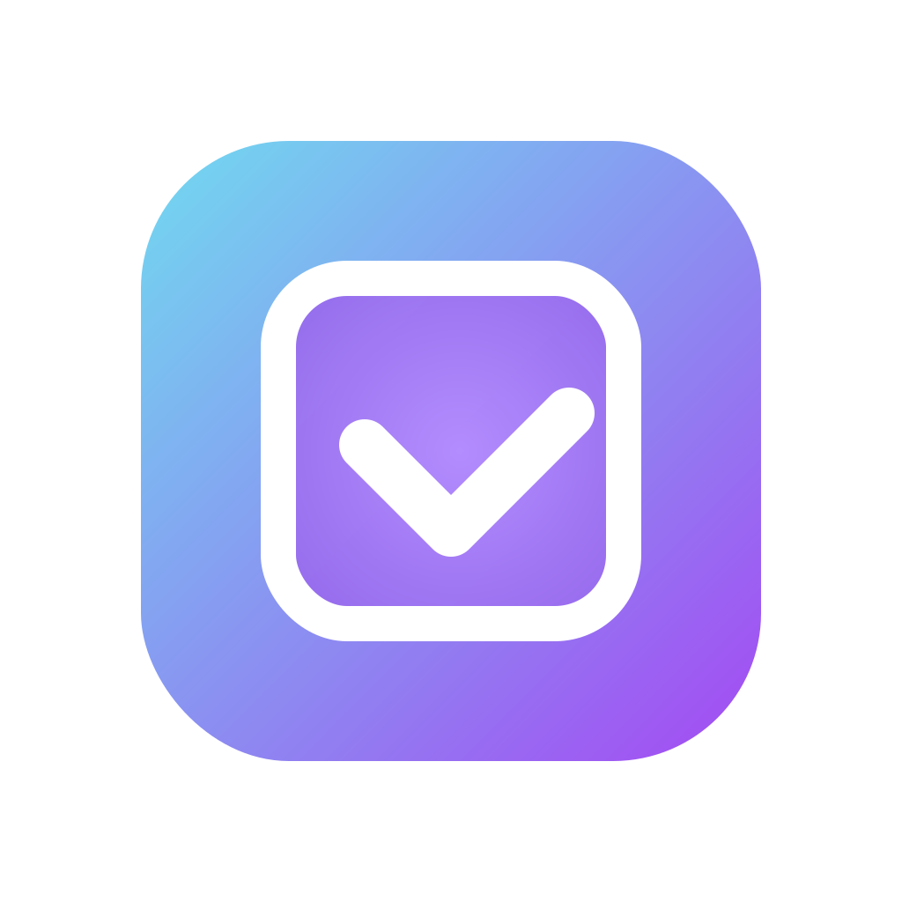
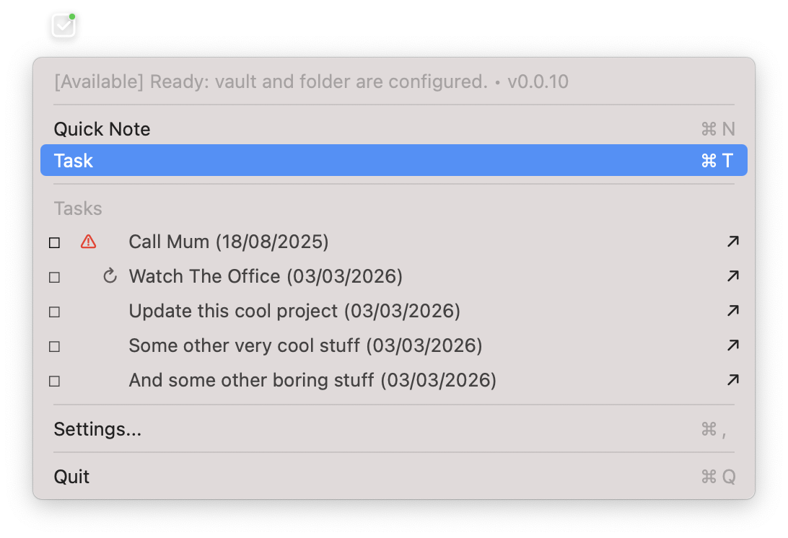
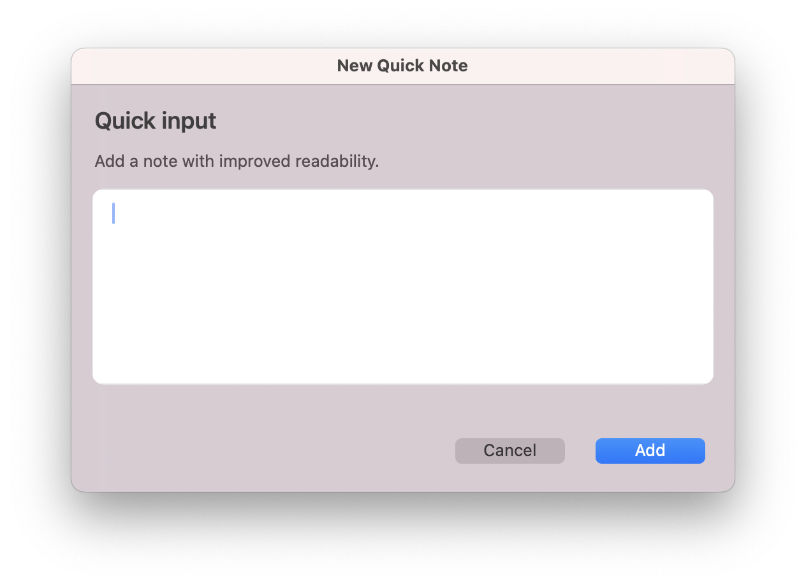
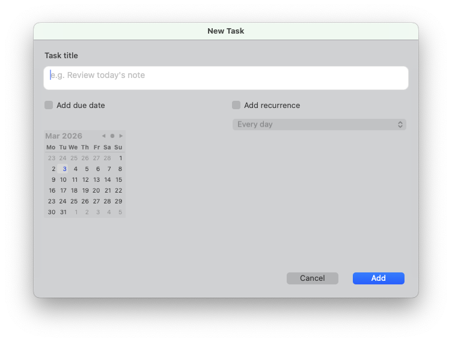
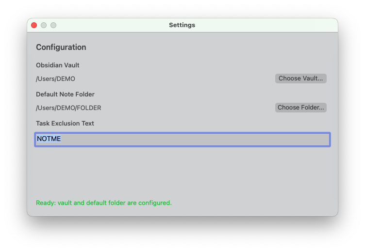

<p align="center">
  
</p>

<h1 align="center">Obsidian Quick Note Task</h1>

<p align="center">
  Capture notes and tasks in seconds from your macOS menu bar, directly into your Obsidian daily note.
</p>

<p align="center">
  <a href="#latest-dmg-download">Download DMG</a> •
  <a href="#quick-start">Quick Start</a> •
  <a href="#why-people-like-it">Why It Stands Out</a>
</p>

## Why People Like It

- Capture from the menu bar without breaking your flow.
- Write straight to your Obsidian daily note (`YYYY-MM-DD - Note.md`).
- Add tasks with an optional due date from a calendar picker.
- See due-today and overdue tasks directly in the menu dropdown.
- Filter visible dropdown tasks with a configurable exclusion text.
- Complete tasks from dropdown and auto-reschedule recurring tasks.
- Clean focused UI with inline confirmations and fast close-on-success.
- Simple distribution via GitHub Releases.

## Product Snapshot

- Platform: macOS (`.app` + `.dmg`)
- Stack: Swift + AppKit
- UX model: menu bar first, configuration-aware actions
- Storage: local filesystem only (your Obsidian vault)

## Demo Screens

### 1. Menu Dropdown (due/overdue + actions)



### 2. Quick Note Capture



### 3. New Task (due date + recurrence column)



### 4. Settings



## Recurring Tasks

Recurring tasks are detected with a `🔁` rule at the end of a task line.

Supported recurrence rules:

- `🔁 every day` or `🔁 daily`
- `🔁 every week` or `🔁 weekly`
- `🔁 every month` or `🔁 monthly`
- `🔁 every year` or `🔁 yearly`
- `🔁 every N day(s)` (example: `🔁 every 3 days`)
- `🔁 every N week(s)` (example: `🔁 every 2 weeks`)
- `🔁 every N month(s)` (example: `🔁 every 2 months`)
- `🔁 every N year(s)` (example: `🔁 every 2 years`)

Example:

```md
- [ ] Pay rent 📅 2026-03-03 🔁 every month
```

When a recurring task is completed from the dropdown, the app marks it done and appends the next occurrence automatically.

## Quick Start

1. Download the latest DMG from the section below.
2. Move `ObsidianQuickNoteTask.app` to `/Applications`.
3. For personal unsigned builds, run once:

```bash
xattr -dr com.apple.quarantine "/Applications/ObsidianQuickNoteTask.app"
```

4. Launch the app, open `Settings`, then configure:
   - your local Obsidian vault,
   - your default folder where notes/tasks are created.

Or install/update automatically in one command:

```bash
bash <(curl -fsSL https://raw.githubusercontent.com/blamouche/obsidian-quick-note-task/main/scripts/install_latest.sh)
```

## Latest DMG Download

<!-- DMG_LINK_START -->

Latest DMG: [https://github.com/blamouche/obsidian-quick-note-task/releases/download/1.1.13/ObsidianQuickNoteTask-1.1.13.dmg](https://github.com/blamouche/obsidian-quick-note-task/releases/download/1.1.13/ObsidianQuickNoteTask-1.1.13.dmg)
Last update: 2026-03-09 (UTC)
<!-- DMG_LINK_END -->

## Local Development

```bash
swift build
swift run ObsidianQuickNoteTaskApp
```

## Release Automation

GitHub Actions (`.github/workflows/release.yml`) automatically:

- builds a production app bundle,
- packages a DMG,
- publishes it to GitHub Releases,
- updates this README download link,
- updates [`Releases.md`](Releases.md) with versioned "Added" notes.

## Versioning Strategy

Versioning follows `X.Y.Z` with CI automation:

- `X.0.0` (major) only on explicit manual request (`workflow_dispatch` with `major_bump=true` in `.github/workflows/versioning.yml`).
- `0.Y.0` (minor) automatically when a new branch is seen for the first time.
- `0.Y.Z` (patch) automatically on each commit push (patch increment based on pushed commits count).

Canonical version is stored in [`VERSION`](VERSION). Branch creation markers are tracked in `.versioning/branches/`.

## Current Limitations

- In this environment, `swift test` may fail if `XCTest` is unavailable in the active toolchain.
